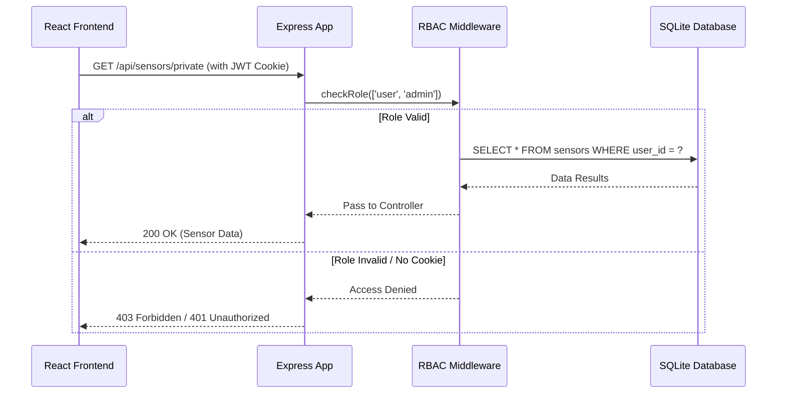

# Login Page

### 1. Request Lifecycle & RBAC Flow

This diagram shows how a request (like "Edit Dashboard") is intercepted by your middleware to check if the user has the correct role before touching the database.



---

### 2. Layout Distribution (12-Column Grid)

This table visualizes how the CSS grid columns are allocated based on the user's role.

| Role | Sidebar (Col 1-3) | Main Content (Col 4-12) | Header Actions |
| --- | --- | --- | --- |
| **Guest** | [ Empty ] | **Full Width (1-12)** | Login / Sign Up |
| **User** | Nav, Profile, Settings | Sensor Graph + Config | Logout, User Icon |
| **Admin** | Nav, User Mgmt, Logs | Global Sensor CRUD | Logout, Admin Badge |

---

### 3. Data Flow (Component Architecture)

This bash-style visualization shows how the `AuthContext` you are about to build acts as the "brain" for the frontend, feeding data to the rest of the app.

```bash
[ AuthContext (Provider) ]
    |
    |-- State: { user: { role: 'admin' }, loading: false }
    |
    |---- [ Layout Wrapper ] ---------------------------------------+
    |     | (Reads context.role to set CSS Grid template)           |
    |     |                                                         |
    |     |-- [ Sidebar ] <--- (Hidden if guest)                    |
    |     |                                                         |
    |     |-- [ Dashboard Page ]                                    |
    |           |-- [ TimeRange Selector ] <--- (Disabled if guest) |
    |           |-- [ Recharts Component ]                          |
    |           |-- [ Admin CRUD Table ]   <--- (Only if admin)     |
    +---------------------------------------------------------------+

```

---

### 4. Database Relationship (ERD)

Even though SQLite is simple, the relationship between users and sensors is what makes your RBAC work.

| Table: `users` | Table: `sensors` |
| --- | --- |
| `id` (PK) | `id` (PK) |
| `username` | `user_id` (FK -> users.id) |
| `password_hash` | `sensor_type` (e.g., 'temp', 'humidity') |
| `role` ('guest', 'user', 'admin') | `value` |
| `created_at` | `timestamp` |

---

### Tip for Claude.code

When you ask Claude to build the **Frontend Layout**, show it this:

> "Implement the Layout using a `grid-template-columns: repeat(12, 1fr)` container. If `auth.user.role` is 'guest', make the `<Main />` component `grid-column: 1 / 13`. Otherwise, make `<Sidebar />` span `1 / 4` and `<Main />` span `4 / 13`."

**Would you like me to write the specific CSS Module code that handles this 12-column responsive toggle?**
