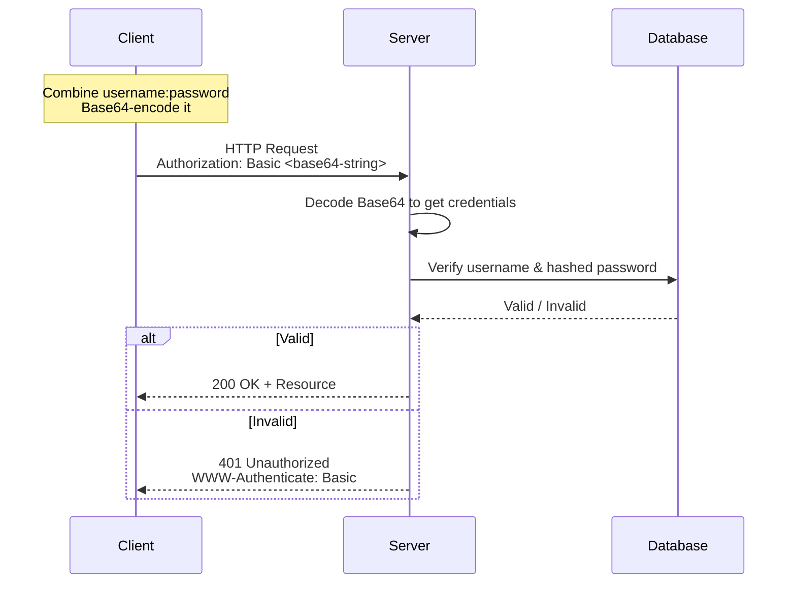
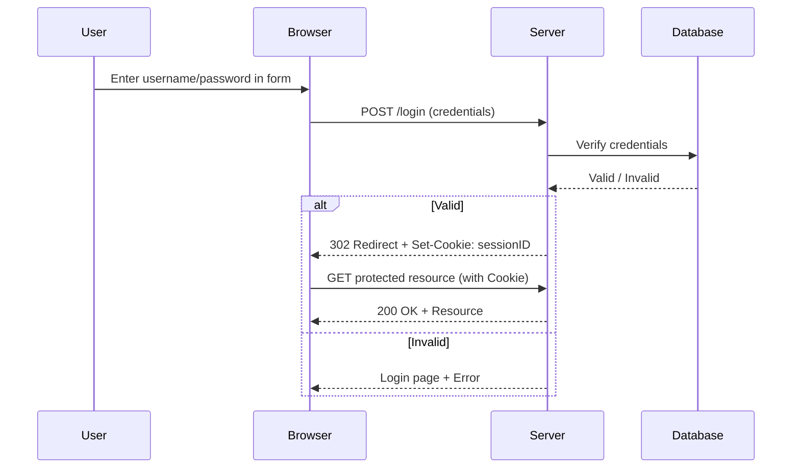
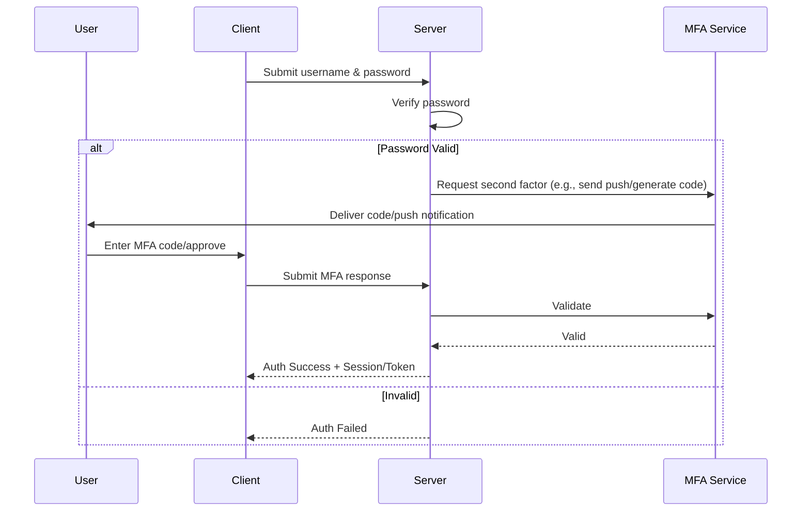
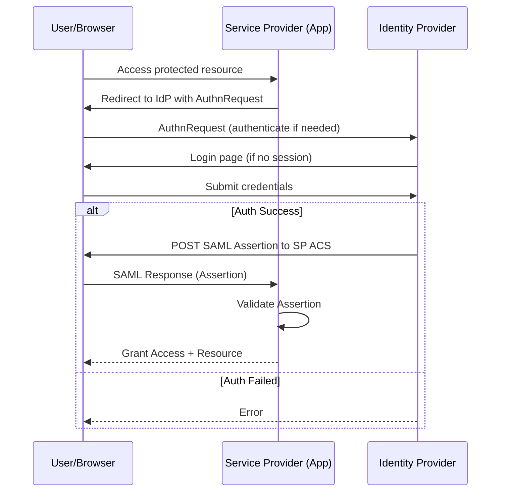

# Authentication Methods
Authentication methods verify a user's identity before granting access to systems, applications, or resources
## Basic Authentication (Base64 Encoding)
> A simple HTTP-based method where the client sends a username and password with every request

**Why Base64?**
> It ensures the credentials can be transmitted safely over text-only protocols without special characters causing issues. However, Base64 is easily reversible (not secure on its own), so it must be used over HTTPS to prevent interception
- **Pros**: Simple and built into HTTP
- **Cons**: Insecure without encryption; credentials are sent repeatedly and can be decoded easily if intercepted
- **Common use**: APIs, internal services (always with TLS/HTTPS)
  
## Form-Based Authentication
> The most common method for web applications. Users enter credentials (username/password) into an HTML login form, which is submitted via POST to the server

- **Pros**: User-friendly, familiar (e.g., login pages on websites like banking or email)
- **Cons**: Vulnerable to phishing, session hijacking, or brute-force attacks if not secured properly (e.g., no rate limiting or weak passwords)
- **Plus**: Often combined with CAPTCHA, password policies, or redirects to HTTPS
- **Common use**: Traditional websites and web apps

## Multi-Factor Authentication
> Requires two or more independent factors to verify identity, adding layers beyond just a password

- Factors:
  - Something you know (password/PIN).
  - Something you have (phone for SMS/code, authenticator app like Google Authenticator, hardware token).
  - Something you are (biometrics: fingerprint, face ID).
  - Sometimes location or behavior.
- How it works: After entering a password, a second step (e.g., app-generated code, push notification, or biometric scan) is required.
- Pros: Dramatically increases security—even if a password is stolen, attackers need the second factor.
- Cons: Can add friction (extra steps); some methods (e.g., SMS) are vulnerable to SIM swapping.
- Common use: Banking, email (e.g., Google, Microsoft), corporate logins. Often mandatory for compliance (e.g., HIPAA, PCI).

## Single Sign-On
> Allows users to authenticate once and gain access to multiple applications or services without re-entering credentials.

- How it works: Relies on a central Identity Provider (IdP) (e.g., Okta, Azure AD, Google). The user logs in to the IdP, which issues a token (via protocols like SAML, OAuth 2.0, or OpenID Connect). Connected apps trust this token for access.
- Pros: Improves user experience (less password fatigue), centralizes management, and enhances security through one strong login point.
- Cons: If the IdP is compromised, access to all linked apps is at risk (single point of failure).
- Common use: Enterprise environments (e.g., logging into Microsoft 365 grants access to Teams, Outlook, etc.) or consumer apps (e.g., "Sign in with Google").
