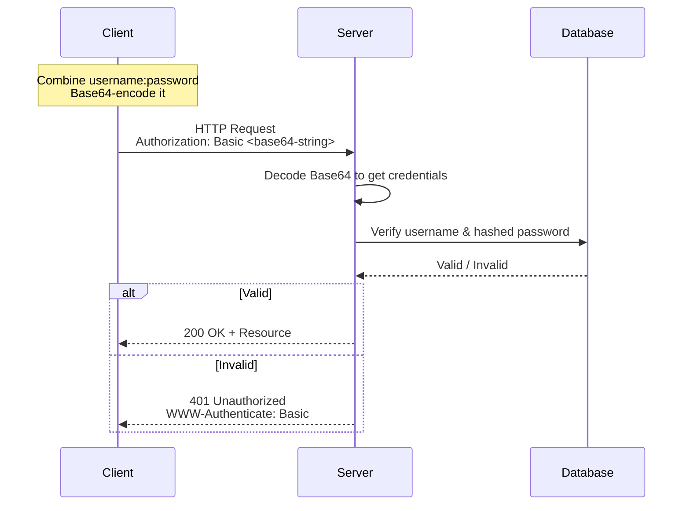
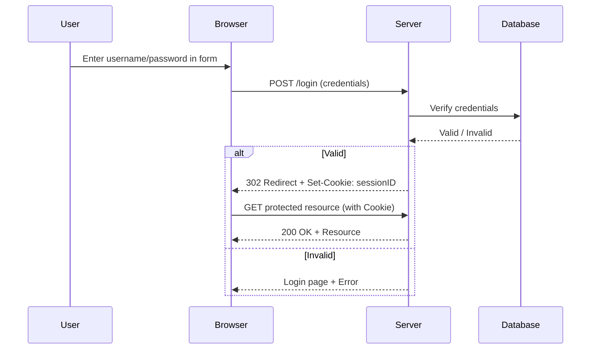
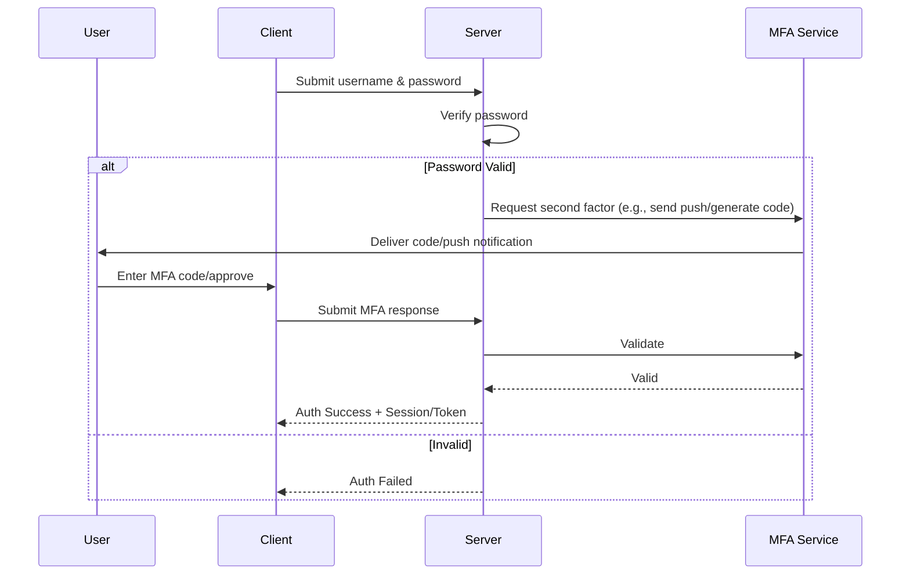
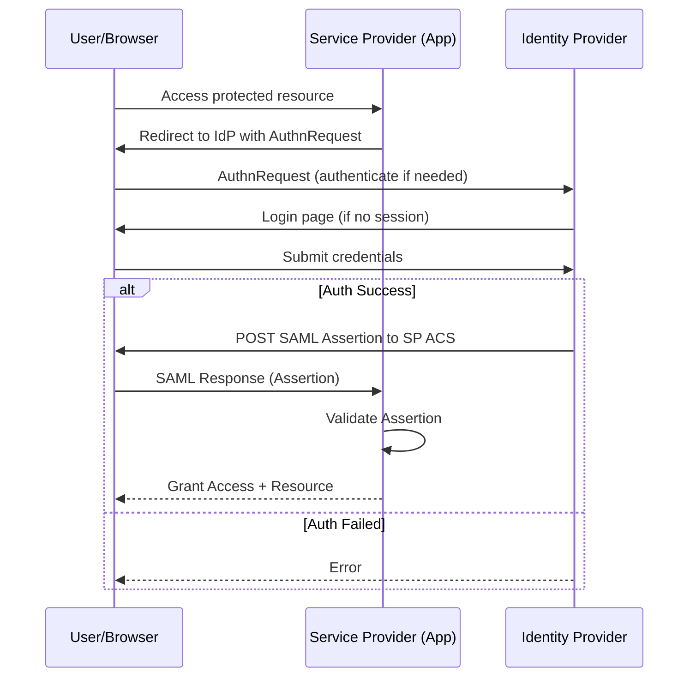
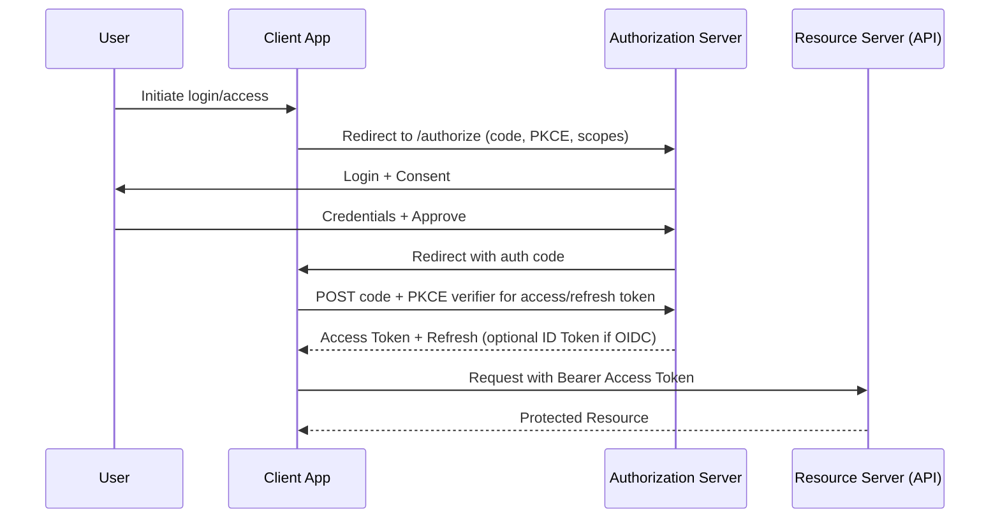
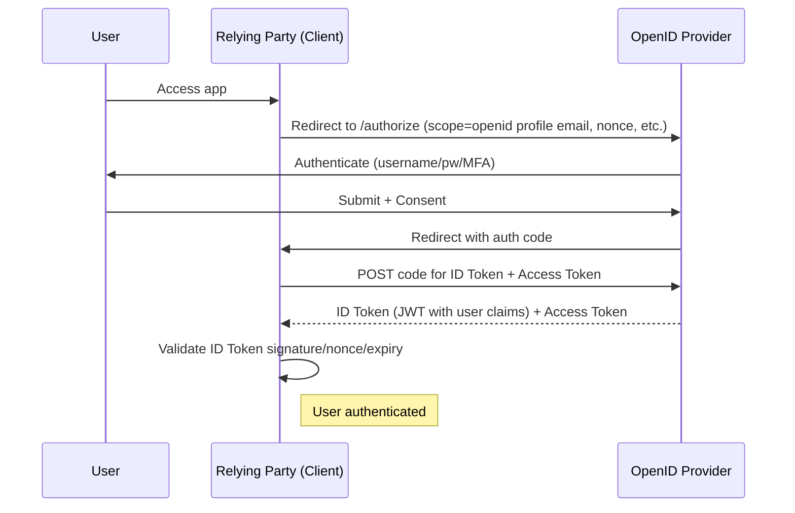
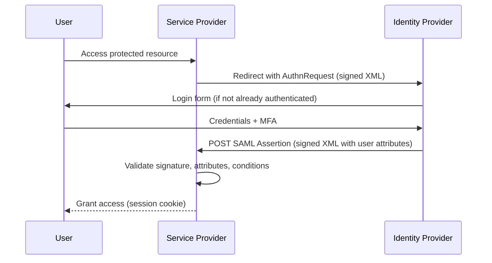
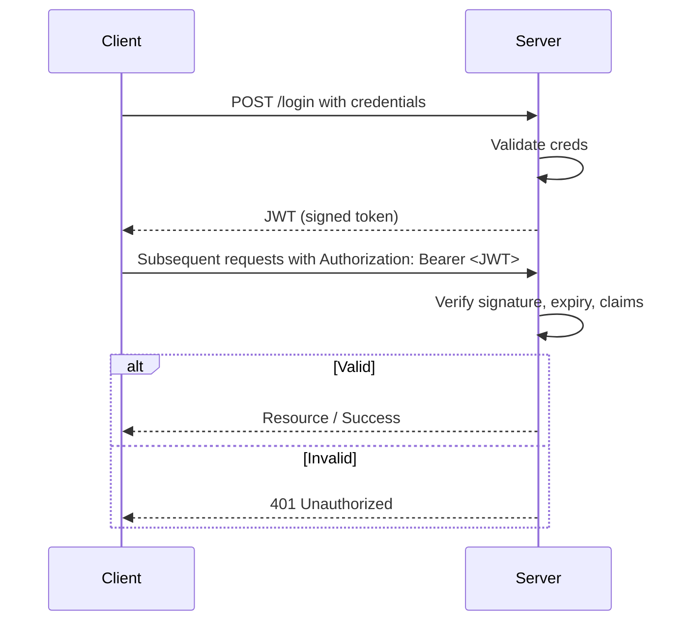

# Authentication Methods
> Authentication methods verify a user's identity before granting access to systems, applications, or resources

### Basics Authentications
1. **Basic** ~ Username/password sent in every request (Base64 encoded)
-  Simple but insecure — like shouting your credentials across the room
2. **Form** ~ Login page(username/password submitted via HTML form)
- Server creates a session (stored on server) and sends a cookie to your browser for future requests

> [!NOTE]
> These are single-app only — you log in separately for every site/app

### Adding Security Layers
**MFA** ~ extra layer on top of anything (password + app code, biometric, hardware key)
> Makes stolen passwords much less useful

### Improving User Experience
**SSO** ~ Log in once and access multiple apps/sites without re-logging in
- OAuth 2.0 **Authorization framework** — lets an app access your data on another service without sharing your password
> Uses access tokens (often JWTs). Secure flows with auth code + PKCE
- OIDC **Authentication layer** built on top of OAuth 2.0 (Adds an ID token)
> Perfect for "Sign in with Google/Apple" — gives both login (who you are) and access
- SAML 2.0 **Authentication protocol** XML-based for enterprise SSO
> Exchanges signed "assertions" between Identity Provider (IdP) and Service Provider (SP)
- JWT **token** compact, signed token containing user info/claims -> Stateless - no server session needed
> Often used for APIs, microservices, or as tokens in other protocols

## Basic Authentication (Base64 Encoding)

## Form-Based Authentication

## Multi-Factor Authentication

## Single Sign-On

  
## OAuth

## OIDC

## SAML

## JWT

