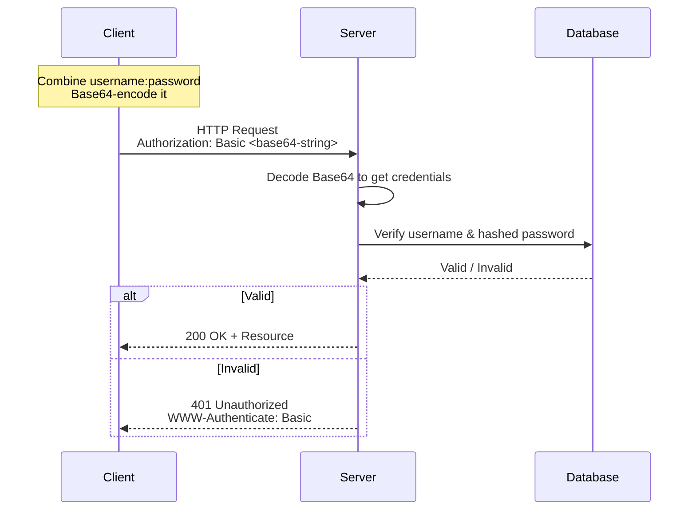
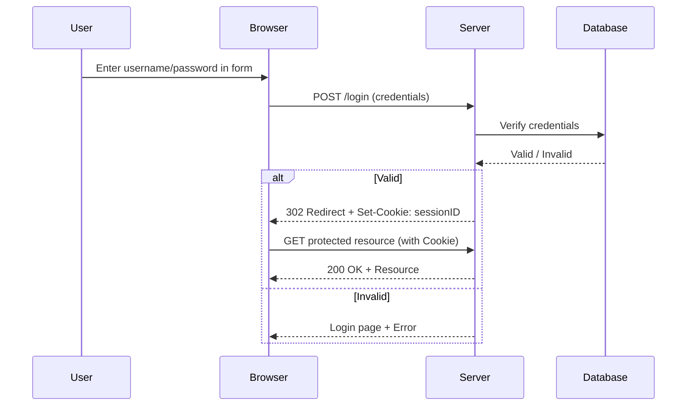
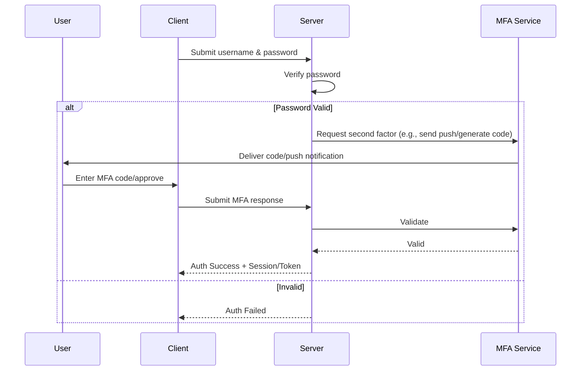
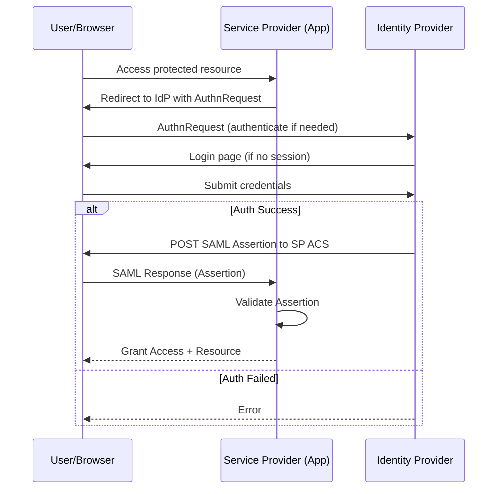
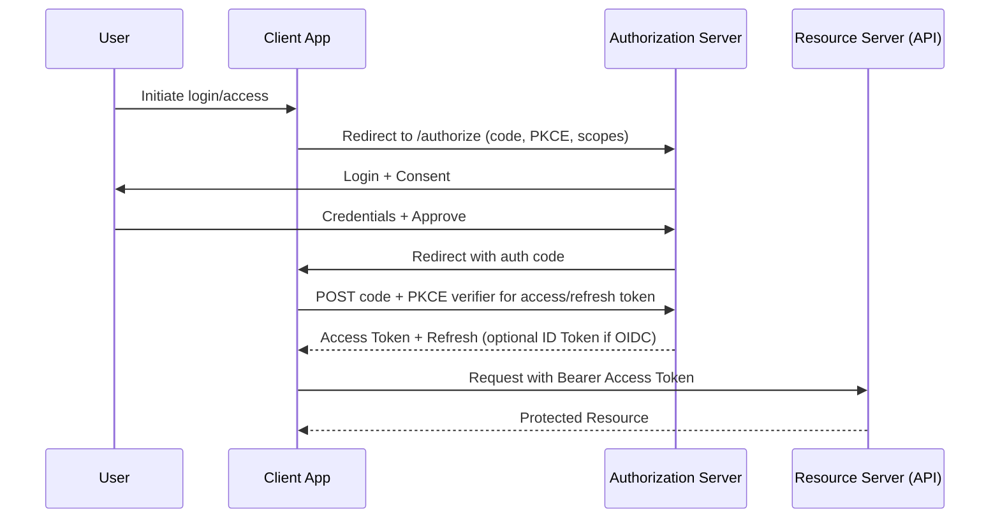
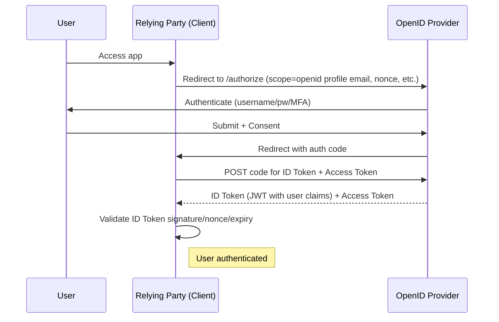
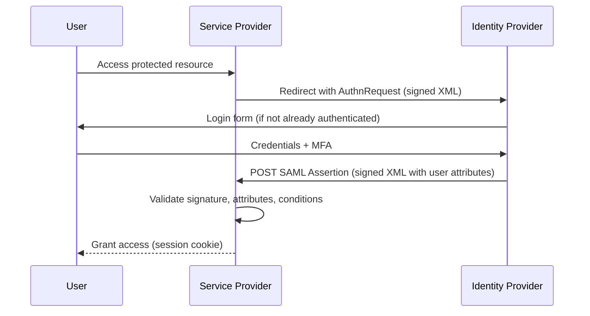
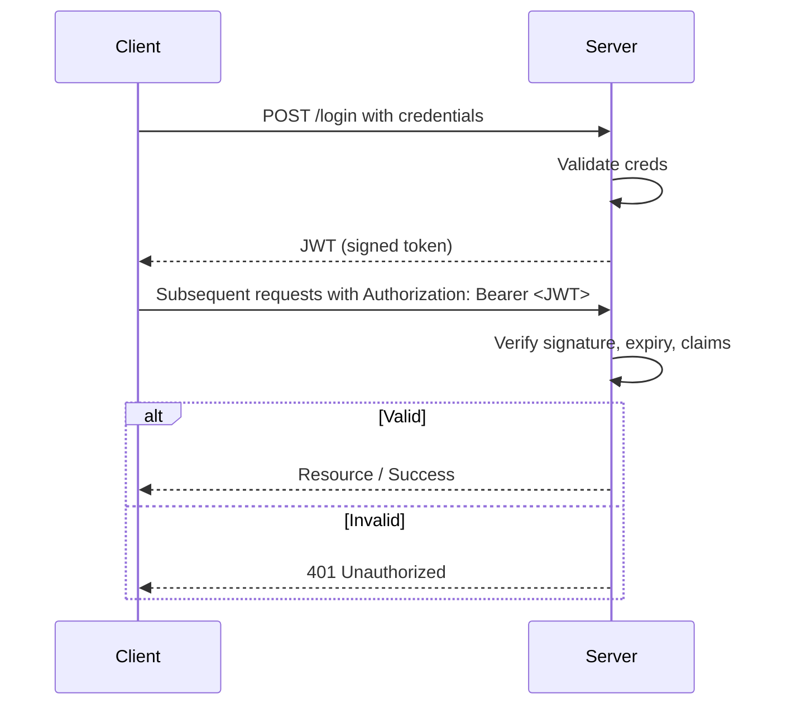

# Authentication Methods
> Authentication methods verify a user's identity before granting access to systems, applications, or resources

### Basics Authentications
1. **Basic** ~ Username/password sent in every request (Base64 encoded)
-  Simple but insecure — like shouting your credentials across the room
2. **Form** ~ Login page(username/password submitted via HTML form)
- Server creates a session (stored on server) and sends a cookie to your browser for future requests

> [!NOTE]
> These are single-app only — you log in separately for every site/app

### Adding Security Layers
**MFA** ~ extra layer on top of anything (password + app code, biometric, hardware key)
> Makes stolen passwords much less useful

### Improving User Experience
**SSO** ~ Log in once and access multiple apps/sites without re-logging in
- OAuth 2.0 **Authorization framework** — lets an app access your data on another service without sharing your password
> Uses access tokens (often JWTs). Secure flows with auth code + PKCE
- OIDC **Authentication layer** built on top of OAuth 2.0 (Adds an ID token)
> Perfect for "Sign in with Google/Apple" — gives both login (who you are) and access
- SAML 2.0 **Authentication protocol** XML-based for enterprise SSO
> Exchanges signed "assertions" between Identity Provider (IdP) and Service Provider (SP)
- JWT **token** compact, signed token containing user info/claims -> Stateless - no server session needed
> Often used for APIs, microservices, or as tokens in other protocols

## Basic Authentication (Base64 Encoding)
1. Strengths: Super simple to implement; no sessions or cookies needed.
2. Weaknesses: Credentials sent with every request (even Base64 is not encrypted); very insecure over HTTP; no built-in logout.
3. Opportunities: Rare use in internal APIs with HTTPS.
4. Threats: Highly vulnerable to interception, replay attacks, and credential stuffing; deprecated in modern apps.

## Form-Based Authentication
1. Strengths: Familiar to users (login page); easy to customize; works with sessions/cookies.
2. Weaknesses: Session hijacking risks (cookie theft); server-side state needed; prone to CSRF without protection.
3. Opportunities: Still common in traditional web apps; easy to add MFA.
4. Threats: Phishing and brute-force attacks; being replaced by token-based systems.

## Multi-Factor Authentication
1. Strengths: Greatly improves security (something you know + have/are).
2. Weaknesses: Adds friction for users; can be bypassed (e.g., phishing for codes).
3. Opportunities: Essential today; integrates easily with most systems; push toward passwordless.
4. Threats: Social engineering or SIM-swapping attacks; user resistance to extra steps.

## Single Sign-On
1. Strengths: Huge convenience—one login for many apps; better user experience.
2. Weaknesses: Single point of failure (if IdP compromised, all apps at risk).
3. Opportunities: Widely adopted in enterprises and cloud services.
4. Threats: Centralized attack target; dependency on identity provider uptime.

  
## OAuth
1. Strengths: Secure delegated access without sharing passwords; flexible flows.
2. Weaknesses: Complex to implement correctly; vulnerable if flows misused.
3. Opportunities: Foundation for modern API access; evolving standards (e.g., OAuth 2.1).
4. Threats: Token theft or misconfiguration leaks; phishing for auth codes.

## OIDC
1. Strengths: Adds reliable authentication to OAuth; modern, mobile-friendly; great for "Login with...".
2. Weaknesses: Still complex; relies on proper HTTPS and token handling.
3. Opportunities: Preferred for new apps; excellent libraries and support.
4. Threats: Growing attack surface as adoption increases; potential for ID token forgery if keys compromised.

## SAML
1. Strengths: Robust enterprise SSO; strong security with XML signatures.
2. Weaknesses: Verbose and complex (XML-heavy); poor for mobile/SPAs.
3. Opportunities: Still dominant in legacy enterprise environments.
4. Threats: Being phased out for newer apps; high setup cost drives shift to OIDC.

## JWT
1. Strengths: Stateless, compact, self-contained; perfect for APIs and microservices.
2. Weaknesses: Can't easily revoke without extra systems; size can grow with claims.
3. Opportunities: Core of modern token-based auth (used in OIDC/OAuth).
4. Threats: Algorithm confusion attacks or weak keys; no built-in encryption for sensitive data.

